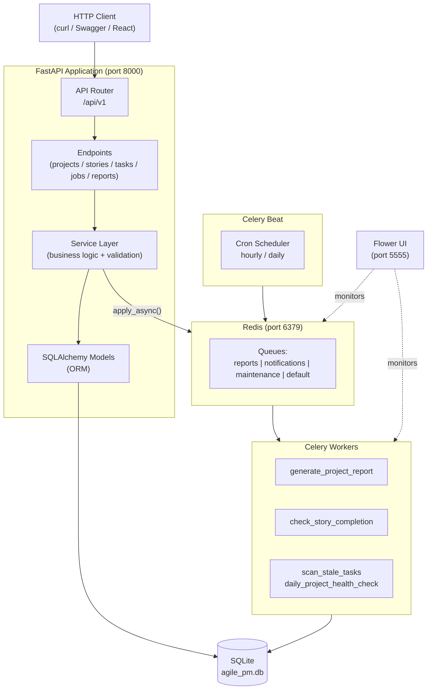

# Agile PM Setup

A full-stack agile project management API for small teams (3–10 users), built with FastAPI, async SQLAlchemy, and Celery. Implements a strict **Project → User Story → Task** hierarchy with background job processing, status-transition validation, and a paginated REST API.

> **Status:** Backend complete (Sprints 1–3). React frontend in progress (Sprint 4).

[](https://python.org)
[](https://fastapi.tiangolo.com)
[](https://sqlalchemy.org)
[](https://docs.celeryq.dev)
[](https://redis.io)
[](https://docker.com)
[](https://pytest.org)
[](https://github.com/astral-sh/uv)

---

## Table of Contents

- [Overview](#overview)
- [Key Features](#key-features)
- [Tech Stack](#tech-stack)
- [Architecture](#architecture)
- [Project Structure](#project-structure)
- [Prerequisites](#prerequisites)
- [Installation](#installation)
- [Environment Configuration](#environment-configuration)
- [Database Setup](#database-setup)
- [Running the Application](#running-the-application)
- [API Documentation](#api-documentation)
- [Background Workers](#background-workers)
- [Testing](#testing)
- [Development Workflow](#development-workflow)
- [Engineering Practices](#engineering-practices)
- [Security](#security)
- [Troubleshooting](#troubleshooting)
- [Roadmap](#roadmap)

---

## Overview

Agile PM Tool is a backend API for managing software projects using a lightweight agile workflow. It is built for small development teams who need to track work across three levels of granularity:

```
Project
  └── User Story
        └── Task
```

A **Project** represents a body of work (e.g., a product feature or release). Each project contains **User Stories** — functional requirements written from a user's perspective, estimated in Fibonacci story points. Each story contains **Tasks** — the concrete implementation steps, estimated in hours.

The system enforces valid status transitions at every level, computes aggregate metrics across the hierarchy, and offloads slow operations (report generation, stale-task scanning) to a background worker queue so API response times remain fast.

---

## Key Features

### Project Management
- Create, retrieve, update, and delete projects
- Status lifecycle: `planning → active → on_hold → completed → archived`
- Business rule: active projects cannot be deleted directly; they must be archived first
- Archived projects can only transition back to `planning`
- Full-text search and status filtering on list endpoints
- Computed stats per project: total stories, total tasks, completion counts

### User Stories
- Scoped to a parent project (URL-enforced hierarchy)
- Story points validated against the Fibonacci sequence (1, 2, 3, 5, 8, 13, 21)
- Status lifecycle with enforced transitions: `backlog → ready → in_progress → in_review → done`
- Priority levels: `low`, `medium`, `high`, `critical`
- Embedded task summaries in story responses
- Aggregate metrics: task completion count, total estimated and actual hours

### Task Management
- Scoped to a parent story and project (full hierarchy validated on every request)
- Status lifecycle: `todo → in_progress → blocked → in_review → done`
- Estimated hours and actual hours tracking
- Auto-trigger: marking a task `done` automatically dispatches a background story-completion check

### Background Processing
- **Project Report Generation** — async markdown report with full metrics (triggered via API, result polled by job ID)
- **Story Completion Check** — analyzes task completion state and returns a structured suggestion
- **Stale Task Scanner** — finds tasks stuck in `in_progress` for more than 48 hours (runs hourly on schedule)
- **Daily Project Health Check** — scores all active projects 0–100 and flags those needing attention (runs at 09:00 UTC)

### Job Tracking
- Every background job is persisted in the database with full status lifecycle
- Status: `pending → processing → completed / failed / retrying`
- Retry with exponential backoff and jitter (up to 3 attempts by default)
- Per-task soft and hard time limits
- Job list and status polling endpoints

### API
- Versioned REST API under `/api/v1`
- Consistent paginated responses with metadata (`total`, `pages`, `has_next`, `has_prev`)
- Filtering and multi-field sorting on all list endpoints
- Structured error responses with `error`, `message`, and `details` fields
- Interactive Swagger UI and ReDoc documentation auto-generated

---

## Tech Stack

| Layer | Technology | Version | Purpose |
|---|---|---|---|
| Backend framework | FastAPI | 0.115+ | Async REST API |
| ORM | SQLAlchemy | 2.0+ | Async database access |
| Database | SQLite + aiosqlite | — | Persistent storage |
| Migrations | Alembic | 1.14+ | Schema version control |
| Validation | Pydantic v2 | 2.10+ | Request/response schemas |
| Configuration | pydantic-settings | 2.6+ | Environment-based config |
| ASGI server | Uvicorn | 0.32+ | Production ASGI server |
| Task queue | Celery | 5.4+ | Background job processing |
| Message broker | Redis | 7 | Celery broker and result backend |
| Worker monitoring | Flower | 2.0+ | Celery task monitoring UI |
| Package manager | uv | latest | Dependency management and venv |
| Testing | Pytest + pytest-asyncio | 8.3+ | Async test suite |
| HTTP test client | HTTPX | 0.28+ | AsyncClient for integration tests |
| Linting/formatting | Ruff | 0.8+ | Code quality |
| Containerization | Docker + Compose | — | Development environment |

---

## Architecture



### Layer Responsibilities

| Layer | Location | Responsibility |
|---|---|---|
| **Endpoints** | `app/api/v1/endpoints/` | HTTP plumbing only — parse request, call service, return response |
| **Services** | `app/services/` | Business logic, status transitions, hierarchy validation, metric computation |
| **Models** | `app/models/` | SQLAlchemy ORM definitions, relationships, enums |
| **Schemas** | `app/schemas/` | Pydantic request validation and response serialization |
| **Workers** | `app/workers/tasks/` | Celery tasks — run in a separate process, use synchronous SQLAlchemy |
| **Core** | `app/core/` | Config, database session factory, custom exceptions |

### Key Design Decisions

- **UUID primary keys** — avoids information leakage about record counts; safe to expose in URLs
- **Async SQLAlchemy** — non-blocking I/O on the FastAPI event loop; workers use a separate synchronous engine
- **Service layer** — business logic is fully decoupled from HTTP; services can be unit-tested without an HTTP context
- **Schema-per-operation** — separate `Create`, `Update`, `Response`, and `Summary` schemas per resource for precise validation
- **Job-first dispatch** — a database job record is created before the Celery task is dispatched, ensuring an audit trail even if the broker is unavailable
- **Graceful degradation** — background job dispatch failures are caught and logged; the primary API response (e.g., task update) always succeeds

---

## Project Structure

```text
agile-pm-tool/
├── docker-compose.yml          # Development environment (API + Redis + Celery + Flower)
├── README.md
│
├── backend/
│   ├── Dockerfile
│   ├── pyproject.toml          # uv project definition and dependencies
│   ├── alembic.ini             # Alembic configuration
│   │
│   ├── alembic/
│   │   ├── env.py              # Async-compatible Alembic environment
│   │   └── versions/           # Auto-generated migration scripts
│   │
│   ├── app/
│   │   ├── main.py             # FastAPI app factory, middleware, exception handlers, lifespan
│   │   │
│   │   ├── api/v1/
│   │   │   ├── router.py       # Assembles all endpoint routers
│   │   │   └── endpoints/
│   │   │       ├── health.py   # GET /health, GET /health/ready
│   │   │       ├── projects.py # CRUD /projects
│   │   │       ├── stories.py  # CRUD /projects/{id}/stories
│   │   │       ├── tasks.py    # CRUD /projects/{id}/stories/{id}/tasks
│   │   │       ├── jobs.py     # GET /jobs, GET /jobs/{id}
│   │   │       └── reports.py  # POST trigger endpoints (202 Accepted)
│   │   │
│   │   ├── core/
│   │   │   ├── config.py       # Pydantic Settings — single source of truth for config
│   │   │   ├── database.py     # Async engine, session factory, get_db() dependency
│   │   │   └── exceptions.py   # Domain exception hierarchy
│   │   │
│   │   ├── models/
│   │   │   ├── base.py         # DeclarativeBase, UUIDMixin, TimestampMixin
│   │   │   ├── project.py      # Project model + ProjectStatus enum
│   │   │   ├── user_story.py   # UserStory model + StoryStatus + StoryPriority enums
│   │   │   ├── task.py         # Task model + TaskStatus + TaskPriority enums
│   │   │   └── job.py          # Job model + JobStatus + JobType enums
│   │   │
│   │   ├── schemas/
│   │   │   ├── common.py       # PaginationParams, PagedResponse[T], StatusMessage
│   │   │   ├── project.py      # ProjectCreate/Update/Response/ListResponse/Summary
│   │   │   ├── user_story.py   # UserStoryCreate/Update/Response/Summary + TaskSummaryInStory
│   │   │   ├── task.py         # TaskCreate/Update/Response/ListResponse
│   │   │   └── job.py          # JobResponse/Summary + trigger request schemas
│   │   │
│   │   ├── services/
│   │   │   ├── project_service.py  # Project CRUD + filtering + stats
│   │   │   ├── story_service.py    # Story CRUD + status transition enforcement
│   │   │   ├── task_service.py     # Task CRUD + full hierarchy validation
│   │   │   └── job_service.py      # Job creation, Celery dispatch, status queries
│   │   │
│   │   └── workers/
│   │       ├── celery_app.py       # Celery app config, queue routing, Beat schedule
│   │       ├── db_helper.py        # Synchronous DB engine/session for workers
│   │       └── tasks/
│   │           ├── report_tasks.py       # generate_project_report task
│   │           ├── notification_tasks.py # check_story_completion task
│   │           └── maintenance_tasks.py  # scan_stale_tasks, daily_project_health_check
│   │
│   └── tests/
│       ├── conftest.py             # In-memory SQLite fixtures, AsyncClient, dependency override
│       ├── unit/
│       │   └── test_schemas.py     # Pydantic validation unit tests
│       └── integration/
│           ├── test_projects_api.py    # Full CRUD + hierarchy + business rule tests
│           └── test_jobs_api.py        # Job creation, dispatch mocking, auto-trigger tests
│
└── frontend/                   # React frontend — Sprint 4 (in progress)
```

---

## Prerequisites

Ensure the following are installed before proceeding.

| Requirement | Minimum Version | Notes |
|---|---|---|
| Python | 3.11 | Required by `pyproject.toml` |
| [uv](https://github.com/astral-sh/uv) | latest | Dependency manager and venv tool |
| Redis | 7 | Required for Celery broker |
| Docker | 24+ | Optional — replaces Redis + manual worker startup |
| Docker Compose | 2.0+ | Optional — runs all services together |
| Git | any | For cloning |

> **Redis** must be running before starting the Celery worker or triggering any background job. If you use Docker Compose, Redis is started automatically.

---

## Installation

### 1. Clone the repository

```bash
git clone https://github.com/<your-username>/agile-pm-tool.git
cd agile-pm-tool
```

### 2. Install uv

```bash
# macOS / Linux
curl -LsSf https://astral.sh/uv/install.sh | sh

# Windows (PowerShell)
powershell -c "irm https://astral.sh/uv/install.ps1 | iex"
```

### 3. Install backend dependencies

```bash
cd backend
uv sync
```

`uv sync` reads `pyproject.toml`, creates `.venv/` inside `backend/`, and installs all production and development dependencies.

### 4. Activate the virtual environment

```bash
# macOS / Linux
source .venv/bin/activate

# Windows
.venv\Scripts\activate
```

> All subsequent commands in this guide assume the virtual environment is active unless the `uv run` prefix is shown.

---

## Environment Configuration

### Create your `.env` file

```bash
cd backend
cp .env.example .env
```

Open `backend/.env` and edit the values. The table below documents every variable.

### Environment variables

| Variable | Required | Default | Description |
|---|---|---|---|
| `APP_NAME` | No | `Agile PM Tool` | Application display name |
| `APP_VERSION` | No | `0.1.0` | Application version string |
| `ENVIRONMENT` | No | `development` | One of `development`, `staging`, `production` |
| `DEBUG` | No | `true` | Enables SQL echo and verbose logging |
| `HOST` | No | `0.0.0.0` | Uvicorn bind host |
| `PORT` | No | `8000` | Uvicorn bind port |
| `DATABASE_URL` | Yes | `sqlite+aiosqlite:///./agile_pm.db` | Async SQLAlchemy connection string |
| `SECRET_KEY` | Yes | — | Minimum 32 characters. Used for future auth signing. |
| `ALGORITHM` | No | `HS256` | JWT algorithm (reserved for auth) |
| `ACCESS_TOKEN_EXPIRE_MINUTES` | No | `30` | JWT expiry (reserved for auth) |
| `ALLOWED_ORIGINS` | No | `http://localhost:3000,http://localhost:5173` | Comma-separated CORS origins |
| `REDIS_URL` | Yes | `redis://localhost:6379/0` | Redis connection URL |
| `CELERY_BROKER_URL` | Yes | `redis://localhost:6379/0` | Celery broker |
| `CELERY_RESULT_BACKEND` | Yes | `redis://localhost:6379/0` | Celery result storage |

### Generating a secure `SECRET_KEY`

```bash
python -c "import secrets; print(secrets.token_hex(32))"
```

Paste the output as the value of `SECRET_KEY` in your `.env`.

> **Never commit `.env` to Git.** It is listed in `.gitignore`. Always use `.env.example` for reference.

---

## Database Setup

The application uses **SQLite** via the async `aiosqlite` driver. The database file (`agile_pm.db`) is created automatically. Schema migrations are managed with **Alembic**.

### Apply all migrations

```bash
cd backend
alembic upgrade head
```

This applies every migration in `alembic/versions/` in order and creates the database file if it does not exist.

### Check current migration state

```bash
alembic current
```

### View migration history

```bash
alembic history --verbose
```

### Create a new migration after model changes

```bash
alembic revision --autogenerate -m "describe your change"
alembic upgrade head
```

### Roll back one migration

```bash
alembic downgrade -1
```

### Roll back to the beginning

```bash
alembic downgrade base
```

### Database schema

Four tables are created by the migrations:

| Table | Model | Description |
|---|---|---|
| `projects` | `Project` | Top-level work containers |
| `user_stories` | `UserStory` | Feature requirements scoped to a project |
| `tasks` | `Task` | Concrete work items scoped to a story |
| `jobs` | `Job` | Background job audit trail |

All tables use:
- **UUID string primary keys** (generated in Python, not the database)
- **`created_at` / `updated_at` timestamps** (UTC, set automatically)
- **Cascade deletes**: deleting a project deletes all its stories; deleting a story deletes all its tasks

---

## Running the Application

### Option A — Docker Compose (recommended)

Starts all services (API, Redis, Celery worker, Celery Beat, Flower) with a single command.

```bash
# From the repository root
docker compose up --build
```

| Service | URL |
|---|---|
| FastAPI API | http://localhost:8000 |
| Swagger UI | http://localhost:8000/api/docs |
| ReDoc | http://localhost:8000/api/redoc |
| Flower (worker monitor) | http://localhost:5555 |
| Redis | localhost:6379 |

To stop all services:

```bash
docker compose down
```

To stop and remove all volumes (clears the database and Redis data):

```bash
docker compose down -v
```

---

### Option B — Manual (four terminals)

Use this if you want hot-reload during development or need to debug individual services.

**Terminal 1 — FastAPI**

```bash
cd backend
source .venv/bin/activate
uvicorn app.main:app --reload --host 0.0.0.0 --port 8000
```

**Terminal 2 — Celery Worker**

```bash
cd backend
source .venv/bin/activate
celery -A app.workers.celery_app worker \
  --loglevel=info \
  -Q default,reports,notifications,maintenance
```

**Terminal 3 — Celery Beat** (periodic task scheduler)

```bash
cd backend
source .venv/bin/activate
celery -A app.workers.celery_app beat --loglevel=info
```

**Terminal 4 — Flower** (optional — Celery monitoring UI)

```bash
cd backend
source .venv/bin/activate
celery -A app.workers.celery_app flower --port=5555
```

> **Redis must be running** before starting any Celery process. Install and start Redis locally:
>
> ```bash
> # macOS
> brew install redis && brew services start redis
>
> # Ubuntu/Debian
> sudo apt install redis-server && sudo systemctl start redis
>
> # Windows
> # Use WSL2, or run Redis via Docker:
> docker run -d -p 6379:6379 redis:7-alpine
> ```

---

## API Documentation

### Base URL

```
http://localhost:8000/api/v1
```

### Interactive documentation

| Interface | URL |
|---|---|
| Swagger UI | http://localhost:8000/api/docs |
| ReDoc | http://localhost:8000/api/redoc |
| OpenAPI JSON | http://localhost:8000/api/openapi.json |

All request schemas, response schemas, validation rules, and example values are available in the Swagger UI.

---

### Endpoint Reference

#### Health

| Method | Endpoint | Description |
|---|---|---|
| `GET` | `/api/v1/health/` | Liveness check — confirms the process is running |
| `GET` | `/api/v1/health/ready` | Readiness check — confirms database connectivity |

#### Projects

| Method | Endpoint | Description |
|---|---|---|
| `POST` | `/api/v1/projects/` | Create a project |
| `GET` | `/api/v1/projects/` | List projects (paginated, filterable, sortable) |
| `GET` | `/api/v1/projects/{project_id}` | Get project with computed stats |
| `PATCH` | `/api/v1/projects/{project_id}` | Partial update |
| `DELETE` | `/api/v1/projects/{project_id}` | Delete (blocked if status is `active`) |

**List query parameters:** `page`, `page_size`, `status`, `search`, `sort_by`, `sort_order`

#### User Stories

| Method | Endpoint | Description |
|---|---|---|
| `POST` | `/api/v1/projects/{project_id}/stories/` | Create a story within a project |
| `GET` | `/api/v1/projects/{project_id}/stories/` | List stories (paginated, filterable) |
| `GET` | `/api/v1/projects/{project_id}/stories/{story_id}` | Get story with embedded tasks and stats |
| `PATCH` | `/api/v1/projects/{project_id}/stories/{story_id}` | Partial update with transition validation |
| `DELETE` | `/api/v1/projects/{project_id}/stories/{story_id}` | Delete (blocked if status is `in_progress`) |

**List query parameters:** `page`, `page_size`, `status`, `assignee_name`, `sort_by`, `sort_order`

#### Tasks

| Method | Endpoint | Description |
|---|---|---|
| `POST` | `/api/v1/projects/{project_id}/stories/{story_id}/tasks/` | Create a task |
| `GET` | `/api/v1/projects/{project_id}/stories/{story_id}/tasks/` | List tasks (paginated, filterable) |
| `GET` | `/api/v1/projects/{project_id}/stories/{story_id}/tasks/{task_id}` | Get a task |
| `PATCH` | `/api/v1/projects/{project_id}/stories/{story_id}/tasks/{task_id}` | Partial update — marking `done` auto-triggers story check |
| `DELETE` | `/api/v1/projects/{project_id}/stories/{story_id}/tasks/{task_id}` | Delete a task |

**List query parameters:** `page`, `page_size`, `status`, `assignee_name`, `sort_by`, `sort_order`

#### Background Jobs

| Method | Endpoint | Description |
|---|---|---|
| `GET` | `/api/v1/jobs/` | List all jobs (paginated, filterable by type/status/project) |
| `GET` | `/api/v1/jobs/{job_id}` | Poll job status and retrieve result |

**List query parameters:** `page`, `page_size`, `job_type`, `status`, `project_id`

#### Reports & Async Triggers

| Method | Endpoint | Returns | Description |
|---|---|---|---|
| `POST` | `/api/v1/reports/projects/{project_id}/generate` | `202 Accepted` + `job_id` | Trigger async project report |
| `POST` | `/api/v1/reports/projects/{project_id}/stories/{story_id}/check-completion` | `202 Accepted` + `job_id` | Trigger async story completion analysis |
| `POST` | `/api/v1/reports/maintenance/scan-stale-tasks` | `202 Accepted` + `job_id` | Manually trigger stale task scan |

---

### Response format

#### Paginated list

```json
{
  "items": [...],
  "total": 42,
  "page": 1,
  "page_size": 20,
  "pages": 3,
  "has_next": true,
  "has_prev": false
}
```

#### Error response

```json
{
  "error": "not_found",
  "message": "Project with id 'abc' not found",
  "details": { "project_id": "abc" }
}
```

#### HTTP status codes

| Code | Meaning |
|---|---|
| `200` | Success |
| `201` | Resource created |
| `202` | Background job accepted |
| `404` | Resource not found |
| `409` | Business rule conflict (e.g., deleting an active project) |
| `422` | Validation error or invalid status transition |
| `500` | Internal server error |

---

## Background Workers

### Why async jobs?

Certain operations — generating a full project report, scanning all tasks for staleness — can be slow. Running them synchronously would block the API and increase response latency. Instead:

1. The API creates a `Job` record in the database (`status: pending`)
2. The task is dispatched to Redis
3. The API responds immediately with `202 Accepted` and a `job_id`
4. The Celery worker picks up the task, runs it, and updates the `Job` record
5. The client polls `GET /api/v1/jobs/{job_id}` until `status` is `completed` or `failed`

### Queue routing

| Queue | Tasks routed to it |
|---|---|
| `reports` | `generate_project_report` |
| `notifications` | `check_story_completion` |
| `maintenance` | `scan_stale_tasks`, `daily_project_health_check` |
| `default` | Any unrouted task |

### Scheduled tasks (Celery Beat)

| Task | Schedule | Description |
|---|---|---|
| `scan_stale_tasks` | Every hour at `:00` | Finds tasks in `in_progress` for > 48 hours |
| `daily_project_health_check` | Daily at 09:00 UTC | Scores all active projects and flags at-risk ones |

### Failure handling

| Mechanism | Configuration |
|---|---|
| Automatic retry | Up to 3 attempts per task |
| Retry strategy | Exponential backoff with jitter |
| Maximum backoff | 60 seconds between retries |
| Soft time limit | 300 seconds (raises `SoftTimeLimitExceeded`) |
| Hard time limit | 360 seconds (kills the worker process for that task) |
| Permanent failure | `Job.status` set to `failed`; `error_message` stored in DB |

### Worker commands

```bash
# Worker (processes tasks)
celery -A app.workers.celery_app worker \
  --loglevel=info \
  -Q default,reports,notifications,maintenance

# Beat scheduler (triggers periodic tasks)
celery -A app.workers.celery_app beat --loglevel=info

# Flower monitoring UI
celery -A app.workers.celery_app flower --port=5555
```

### Monitoring

Flower provides a real-time dashboard for active workers, task history, success/failure rates, and queue depths.

```
http://localhost:5555
```

---

## Testing

### Test strategy

| Type | Location | Approach |
|---|---|---|
| Unit | `tests/unit/` | Pydantic schema validation — no database, no HTTP |
| Integration | `tests/integration/` | Full request/response cycle with in-memory SQLite |

### Test database

Tests use an **in-memory SQLite** database that is created fresh for each test function and destroyed after it. Tests never touch the development database. No external services (Redis, Celery) are required — Celery task dispatch is mocked using `unittest.mock.patch`.

### Run all tests

```bash
cd backend
pytest
```

### Run with verbose output

```bash
pytest -v
```

### Run a specific test file

```bash
pytest tests/integration/test_projects_api.py -v
```

### Run a specific test class or function

```bash
pytest tests/integration/test_projects_api.py::TestCreateProject -v
pytest tests/integration/test_projects_api.py::TestCreateProject::test_create_project_success -v
```

### Run with coverage report

```bash
pytest --cov=app --cov-report=term-missing
```

### Test coverage areas

| Area | Tests cover |
|---|---|
| Schema validation | Required fields, blank names, Fibonacci enforcement, hour bounds |
| Project CRUD | Create, list, filter, search, paginate, get, update, delete |
| Business rules | Active project delete blocked, archived project transition blocked |
| Story CRUD | Create, list, filter, paginate, get, update, delete |
| Story transitions | Valid and invalid status transitions enforced |
| Hierarchy isolation | Story in wrong project returns 404 |
| Task auto-trigger | `done` status dispatches story completion check |
| Graceful degradation | Task update succeeds even when Celery dispatch raises |
| Job API | List, get, filter by type/status |
| Async dispatch | Celery mocked; job record created and queryable |

---

## Development Workflow

### 1. Create a feature branch

```bash
git checkout -b feat/your-feature-name
```

### 2. Install or update dependencies

```bash
cd backend
uv sync
```

To add a new dependency:

```bash
uv add <package-name>
```

To add a development-only dependency:

```bash
uv add --dev <package-name>
```

### 3. Make your changes

### 4. If you changed a model, generate and apply a migration

```bash
alembic revision --autogenerate -m "describe the schema change"
alembic upgrade head
```

### 5. Run tests

```bash
pytest -v
```

### 6. Format and lint

```bash
# Format
ruff format .

# Lint
ruff check .

# Lint with auto-fix
ruff check . --fix
```

### 7. Commit

```bash
git add .
git commit -m "feat(scope): short description

Longer explanation if needed."
```

Commit message format follows [Conventional Commits](https://www.conventionalcommits.org/):

```
feat(projects): add owner_name filter to list endpoint
fix(tasks): correct status transition for blocked → done
chore(deps): update fastapi to 0.116
docs(readme): add troubleshooting section
```

### 8. Push and open a pull request

```bash
git push origin feat/your-feature-name
```

---

## Engineering Practices

| Practice | Implementation |
|---|---|
| **Layered architecture** | Endpoints → Services → Models; each layer has one responsibility |
| **Dependency injection** | FastAPI `Depends()` for DB sessions and service instances; easy to mock in tests |
| **Type hints** | Full type annotation on all function signatures and model fields |
| **Pydantic v2 validation** | Schema-per-operation (`Create` / `Update` / `Response`); validators enforce business constraints at the boundary |
| **Async I/O** | Async SQLAlchemy with `aiosqlite`; non-blocking DB calls on the FastAPI event loop |
| **Database migrations** | Alembic with async-compatible environment; every schema change is versioned |
| **UUID primary keys** | Generated in Python; no information leakage; safe in public URLs |
| **UTC timestamps** | All `created_at` / `updated_at` stored in UTC; never local time |
| **Custom exception hierarchy** | Domain exceptions (`NotFoundError`, `BusinessRuleError`, etc.) converted to HTTP responses in global handlers |
| **Job-first dispatch** | DB job record created before Celery dispatch; audit trail survives broker restarts |
| **Graceful degradation** | Background job failures never propagate to the primary API response |
| **Retry with backoff** | Exponential backoff with jitter prevents thundering herd on failures |
| **Environment-based config** | All configuration via `pydantic-settings`; validated at startup; fails fast on missing required values |
| **Structured logging** | Python `logging` throughout; format includes timestamp, level, logger name, and message |
| **Containerization** | Docker + Compose for reproducible development environments |

---

## Security

### What is implemented

| Practice | Detail |
|---|---|
| **Secrets via environment variables** | `SECRET_KEY`, `DATABASE_URL`, `REDIS_URL` are never hardcoded |
| **`.env` excluded from Git** | `.gitignore` includes `.env`, `*.env`, `.env.local`, `.env.production` |
| **Secret key validation** | `SECRET_KEY` must be at least 32 characters; the application refuses to start if it is shorter |
| **CORS configuration** | `ALLOWED_ORIGINS` is an explicit allowlist; configured via environment variable |
| **Request validation** | All incoming data passes through Pydantic schemas before reaching the service layer; invalid data is rejected with `422` |
| **SQL injection prevention** | All queries use SQLAlchemy ORM with parameterized expressions; no raw string concatenation in queries |
| **Column whitelist for sorting** | Sort-by fields are validated against an explicit whitelist dict in each service; prevents injection via query parameters |
| **Error information disclosure** | In `production` environment, the global exception handler returns a generic message; stack traces are only surfaced in `development` |
| **Hierarchy access control** | Task and story endpoints validate the full `project → story → task` chain on every request; a task in project A is not accessible via project B's URL |

### What is not yet implemented

| Feature | Status |
|---|---|
| Authentication (JWT / sessions) | Not implemented — planned for a future sprint |
| Authorization (per-user data access) | Not implemented — planned |
| Password hashing | Not applicable — no user accounts yet |
| Rate limiting | Not implemented |
| HTTPS / TLS termination | Expected to be handled at the infrastructure layer (reverse proxy) |

> This application does not yet have user authentication. All API endpoints are currently public. Do not deploy to a public network without adding authentication.

---

## Troubleshooting

### Redis connection refused

```
Error: ConnectionRefusedError: [Errno 111] Connection refused (redis://localhost:6379)
```

Redis is not running. Start it:

```bash
# macOS
brew services start redis

# Ubuntu/Debian
sudo systemctl start redis

# Any platform via Docker
docker run -d -p 6379:6379 redis:7-alpine
```

---

### Celery worker cannot find tasks

```
[ERROR] Received unregistered task of type 'app.workers.tasks...'
```

The worker must be started from the `backend/` directory with the virtual environment active, and all four queues must be specified:

```bash
cd backend
source .venv/bin/activate
celery -A app.workers.celery_app worker -Q default,reports,notifications,maintenance --loglevel=info
```

---

### Alembic: `Target database is not up to date`

```bash
cd backend
alembic upgrade head
```

---

### Alembic: `Can't locate revision identified by ...`

The migration history is inconsistent. Reset:

```bash
alembic downgrade base
alembic upgrade head
```

---

### `SECRET_KEY` validation error at startup

```
ValueError: SECRET_KEY must be at least 32 characters long
```

Generate a valid key:

```bash
python -c "import secrets; print(secrets.token_hex(32))"
```

Paste the result into `backend/.env` as `SECRET_KEY=<generated-value>`.

---

### Port 8000 already in use

```bash
# Find the process
lsof -i :8000

# Kill it
kill -9 <PID>
```

Or start Uvicorn on a different port:

```bash
uvicorn app.main:app --reload --port 8001
```

---

### `ModuleNotFoundError` after `uv sync`

Ensure the virtual environment is activated:

```bash
source backend/.venv/bin/activate   # macOS/Linux
backend\.venv\Scripts\activate      # Windows
```

---

### Tests fail with database errors

Tests use an in-memory SQLite database and do not require the development database to exist or be migrated. If tests fail with database errors, check that `conftest.py` is being picked up correctly:

```bash
cd backend
pytest tests/ -v --tb=long
```

---

### Docker: `Permission denied` on SQLite volume

On Linux, the SQLite volume mount may have permission issues. Set the correct ownership:

```bash
sudo chown -R $USER:$USER ./backend/data
```

---

## Roadmap

### Completed

- [x] FastAPI project structure with uv
- [x] Async SQLAlchemy with SQLite + aiosqlite
- [x] Alembic migrations
- [x] Domain models: Project, UserStory, Task, Job
- [x] Pydantic v2 schema layer (Create / Update / Response / Summary per resource)
- [x] Service layer with business rules and status transition enforcement
- [x] Full CRUD API for projects, stories, and tasks
- [x] Pagination, filtering, and sorting on all list endpoints
- [x] Hierarchy access control (project → story → task scoping)
- [x] Background job tracking model with full audit trail
- [x] Celery application with queue routing
- [x] Project report generation task (async, markdown output)
- [x] Story completion check task (auto-triggered on task `done`)
- [x] Stale task scanner (hourly schedule via Celery Beat)
- [x] Daily project health check (daily schedule via Celery Beat)
- [x] Retry with exponential backoff and jitter
- [x] Flower monitoring integration
- [x] Job status polling API
- [x] Unit tests (schema validation)
- [x] Integration tests (API + business rules + async mocking)
- [x] Docker Compose development environment

### In Progress

- [ ] React frontend (Sprint 4)

### Planned

- [ ] User authentication (JWT)
- [ ] Per-user authorization and data isolation
- [ ] Sprint management (group stories into sprints with dates)
- [ ] WebSocket push notifications for job completion
- [ ] PostgreSQL support (production-grade database)
- [ ] CI/CD pipeline (GitHub Actions)
- [ ] Frontend: Kanban board view
- [ ] Frontend: Project dashboard with metrics
- [ ] Frontend: Live job status polling UI

---

## License

No license has been specified in this repository. All rights reserved by the author unless otherwise stated.

---

*Built as part of a full-stack internship evaluation — demonstrating production-minded API design, async architecture, and engineering judgment across a structured sprint workflow.*
